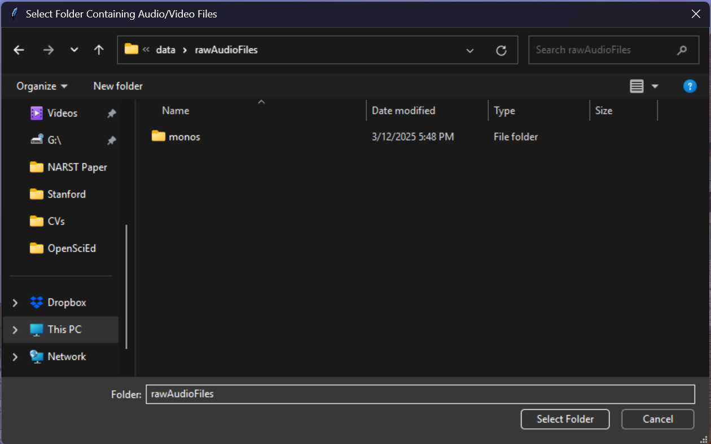
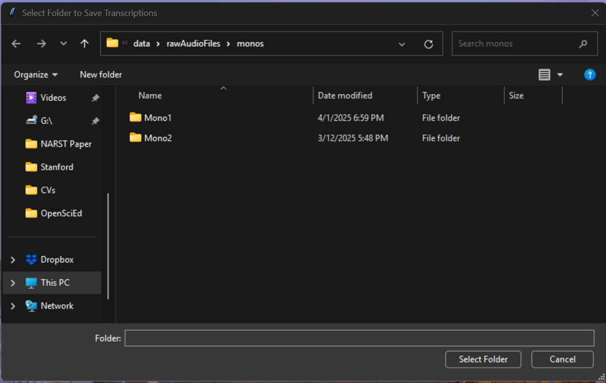
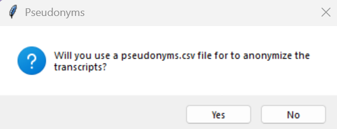

# WhisperX Transcription + Diarization Audio Processing for Researchers
This repository contains a Jupyter notebook for qualitative researchers to transcribe, diarize speakers, and convert audio or video files into various text formats (csv, txt, json, & vtt). The notebook uses advanced transcription and diarization capabilities provided by Whisper and WhisperX, as well as [pyannote speaker-diarization-3.1](https://huggingface.co/pyannote/speaker-diarization-3.1) and [segmentation-3.0](https://huggingface.co/pyannote/segmentation-3.0) libraries from Hugging Face*.  

*A free [Hugging Face](https://huggingface.co/docs/hub/en/security-tokens) token is required specifically for the diarization aspects. The code will not work without it.
 
 The code is derived and built from the following [Medium article](https://towardsdatascience.com/unlock-the-power-of-audio-data-advanced-transcription-and-diarization-with-whisper-whisperx-and-ed9424307281)

1. I wanted the ability to do batch transcriptions of audio files found in multiple subdirectories. 
2. I wanted to take advantage of WhisperX's word level time stamping. 
3. Utilize pyannote's speaker diarization capabilities. 
4. Generate csv, txt, json, and vtt files for each audio file transcribe. 
5. Ability to anonymize specific names and places during transcription. 

### Example CSV output 


## What This Code Does

1. **Device and Configuration Setup**: Sets up the device (GPU or CPU) and other configuration variables like batch size, compute type, and model type.
2. **Library Imports**: Imports necessary libraries including PyTorch, WhisperX, and others for handling audio files, text processing, and file I/O.
3. **Path and File Type Setup**: Defines paths to your audio files and output directories and specifies the types of audio files to process.
4. **Pseudonym Loading**: Loads a CSV file containing pseudonyms for anonymizing transcripts.
5. **Audio Processing Functions**: Includes functions to find audio files, get file modification dates, anonymize text, convert segments to different formats, and process each audio file.
6. **Main Function Execution**: Finds all audio files in the specified directory, processes them, and saves the transcripts in multiple formats (CSV, TXT, JSON, VTT).

## How to Use This Repo

WhisperX documentation found here: https://github.com/m-bain/whisperX

### A. Install General Software
================================================
1. Install Git
2. Install FFMPEG and add to PATH
3. Install Anaconda 

### B. Set Up Conda Environment
================================================   
1. Create Conda environment
```sh
conda create -n whisperxtranscription-env python=3.10
conda activate whisperxtranscription-env
```

2. Install PyTorch https://pytorch.org/get-started/locally/ 

**For Windows/Linux with NVIDIA GPU:**
```sh
pip install numpy==1.26.3 torch==2.3.0 torchvision==0.18.0 torchaudio==2.3.0 --index-url https://download.pytorch.org/whl/cu121
```

**For Mac (CPU-only):**
```sh
pip install numpy==1.26.3 torch==2.3.0 torchvision==0.18.0 torchaudio==2.3.0
```

3. Install WhisperX repository and additional packages
```sh
pip install whisperx==3.2.0

pip install speechbrain ipykernel ipywidgets charset-normalizer pandas nltk plotly matplotlib webvtt-py pypi-json srt python-dotenv tqdm


```
4. Make sure to choose this kernel in the Jupyter notebook
https://code.visualstudio.com/docs/datascience/jupyter-kernel-management 

6. There is an .env file at the same level as this notebook file paste your Hugging Face Token between the " " and save the file. 
```sh
HF_TOKEN="REPLACEWITHHUGGINGFACETOKENHERE"
```
### C. Platform-Specific Setup
=================================================

#### For Windows/Linux with NVIDIA GPU:
1. Install Visual Studio Community https://visualstudio.microsoft.com/downloads/
2. Install NVIDIA CUDA Toolkit 12.1 https://developer.nvidia.com/cuda-12-1-0-download-archive 

#### Check PyTorch and CUDA installation
```sh
import torch
print(torch.__version__)
print(torch.cuda.is_available())
print(torch.cuda.get_device_name(0))
```

#### For Mac (CPU-only):
Mac computers don't support CUDA, so you'll need to install PyTorch with CPU support instead. Follow these steps:

1. **Install PyTorch for CPU (Mac)**
```sh
pip install numpy==1.26.3 torch==2.3.0 torchvision==0.18.0 torchaudio==2.3.0
```

2. **Verify PyTorch installation on Mac**
```sh
import torch
print(torch.__version__)
print(torch.cuda.is_available())  # This will return False on Mac
print("PyTorch is running on:", "CPU" if not torch.cuda.is_available() else "GPU")
```

**Note for Mac users:** The transcription will run on CPU, which will be slower than GPU processing but will work perfectly fine for most use cases. Processing times will depend on your Mac's CPU performance and the length of your audio files.

### D. Setup and Run Jupyter Notebook
=================================================
#### Prepare Pseudonyms CSV
Pseudonyms CSV: Ensure you have a CSV file named pseudonyms.csv in the data directory. This file should contain columns name and pseudonym for anonymizing the transcripts. This isn't a requirement, you will be asked through a popup if you are using one.

#### 1.0 Execute the set-up code
The main function finds all audio files of the types specified in the folder choice that will occur when you run the subsequent code snippet, processes them, and saves the transcripts. To run the code, simply execute the script.

##### Audio File Types
Update the file type(s) of your audio files:
```sh
file_type1 = '.wav'
file_type2 = '.mp3'
file_type3 = '.ogg'
```

#### 2.0 Execute the Run code 

Just push run here. You shouldn't need to change anything here unless you want to output less or more file types. These are mostly functions which are then called at the end of the cell.

1. You should get a popup asking to choose the folder where the files are found (It will also search subfolders).

2. You should then get a popup asking for where the transcription files should be placed (It will replicate the folder structure in which they were found)

3. You will also see a popup asking if you want to anonymize with a pseudonyms.csv file, and if so where it is located.

4. You should then see an output similar to the following (just ignore the warnings):
```sh
Model was trained with pyannote.audio 0.0.1, yours is 3.1.1. Bad things might happen unless you revert pyannote.audio to 0.x.
Model was trained with torch 1.10.0+cu102, yours is 2.3.0+cu121. Bad things might happen unless you revert torch to 1.x.
```
5. When complete you will see where each were written and the folders where they were written to.

### Check the Outputs
Output Files:
The transcripts will be saved in the specified output directory in multiple formats: CSV, TXT, JSON, and VTT

## Conclusion
This code is designed to make it easy to process and transcribe large batches of audio or video files while ensuring anonymity through pseudonymization. Happy transcribing!# WhisperXTranscription4Researchers

## macOS Quick Start (short)

If you're running on macOS (Intel or Apple Silicon), here's a compact set of steps that are known to work and are easy to follow.

1. Install Homebrew (if needed): https://brew.sh/

```sh
brew install ffmpeg
```

2. Create and activate a Python virtual environment (recommended):

```sh
python3 -m venv venv
source venv/bin/activate
python3 -m pip install --upgrade pip
```

3. Install PyTorch:

- CPU-only (works on any macOS):

```sh
python3 -m pip install torch torchvision torchaudio --index-url https://download.pytorch.org/whl/cpu
```

- Apple Silicon (MPS): visit https://pytorch.org/get-started/locally/ and choose the options for macOS + pip to get the exact recommended command for your system — that command will install a wheel that enables MPS where available.

4. Install WhisperX and other dependencies:

```sh
python3 -m pip install whisperx==3.2.0
python3 -m pip install speechbrain ipykernel ipywidgets charset-normalizer pandas nltk plotly matplotlib webvtt-py pypi-json srt python-dotenv tqdm
```

5. Add your Hugging Face token to a `.env` file next to the notebook:

```ini
HF_TOKEN="REPLACEWITHHUGGINGFACETOKENHERE"
```

6. Verify installation / device availability:

```sh
python3 -c "import torch; print(torch.__version__); print('MPS', getattr(torch.backends,'mps',None) is not None and torch.backends.mps.is_available()); print('CUDA', torch.cuda.is_available())"
```

Notes:
- MPS on Apple Silicon is not identical to CUDA — some operations and behavior differ. If you get errors from WhisperX or pyannote, paste the traceback and I can help pin versions.
- After installing or changing packages, restart the Jupyter kernel before re-running the notebook.

If you'd like, I can also create a `requirements.txt` or `environment.yml` (conda) pinned to versions that have been tested on macOS — tell me which format you prefer.

### macOS Conda setup using requirements.txt
=================================================

The steps below use Conda plus this repo's `requirements.txt`. On macOS you should install PyTorch first (CPU or Apple Silicon/MPS) and then install the rest from `requirements.txt`.

1. Install Homebrew (if needed) and FFMPEG

```sh
/bin/bash -c "$(curl -fsSL https://raw.githubusercontent.com/Homebrew/install/HEAD/install.sh)"
brew install ffmpeg
```

2. Install Miniconda (recommended)

- Download from `https://docs.conda.io/en/latest/miniconda.html` and run the macOS installer.
- After installation, open a new terminal so `conda` is on your PATH.

3. Create and activate a Conda environment

```sh
conda create -n whisperxtranscription-env python=3.10 -y
conda activate whisperxtranscription-env
python -m pip install --upgrade pip
```

4. Install PyTorch (macOS)

- CPU-only (works on Intel or Apple Silicon):

```sh
python -m pip install torch torchvision torchaudio --index-url https://download.pytorch.org/whl/cpu
```

- Apple Silicon with MPS acceleration: visit `https://pytorch.org/get-started/locally/` and choose macOS + pip to copy the exact command recommended for your system. That wheel enables MPS on Apple Silicon.

5. Install the rest of the dependencies from requirements.txt

```sh
python -m pip install -r requirements.txt
```

6. (Optional) Register the Conda env as a Jupyter kernel

```sh
python -m ipykernel install --user --name whisperxtranscription-env --display-name "Python (whisperxtranscription-env)"
```

7. Add your Hugging Face token to a `.env` file next to the notebook

```ini
HF_TOKEN="REPLACEWITHHUGGINGFACETOKENHERE"
```

8. Verify PyTorch and device availability

```sh
python - << 'PY'
import torch
print('torch', torch.__version__)
print('CUDA available:', torch.cuda.is_available())
print('MPS available:', hasattr(torch.backends, 'mps') and torch.backends.mps.is_available())
PY
```

Notes:
- If you change packages, restart the Jupyter kernel before re-running the notebook.
- For diarization with pyannote, you need a free Hugging Face token.

### Troubleshooting on macOS: PyAV build errors with FFmpeg 7
=================================================

Symptom: Installing dependencies triggers a build failure for `av` with errors mentioning `AV_OPT_TYPE_CHANNEL_LAYOUT` vs `AV_OPT_TYPE_CHLAYOUT`. This is caused by compiling PyAV 11 against FFmpeg 7 headers.

Fix (use FFmpeg 6 with PyAV 11):

```sh
# Inside your conda env
conda remove -y av pyav ffmpeg
conda install -y -c conda-forge "ffmpeg<7" "pyav==11.*" pkg-config

python -m pip install --upgrade pip
python -m pip install -r requirements.txt
```

If `pip` still attempts to build `av` from source, force a wheel:

```sh
python -m pip install --only-binary=:all: "av==11.*"
```

Alternative via Homebrew (if you prefer system FFmpeg):

```sh
brew install pkg-config ffmpeg
python -m pip install --upgrade pip
python -m pip install --only-binary=:all: "av==11.*"
python -m pip install -r requirements.txt
```
